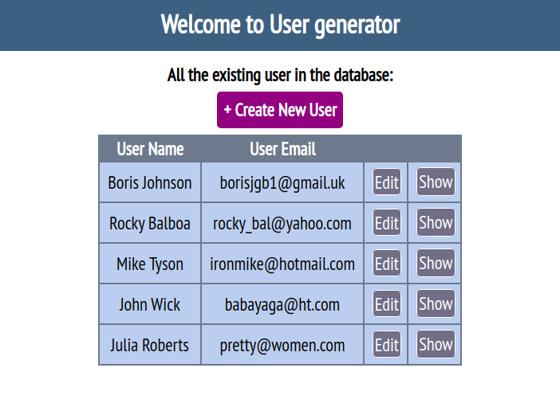
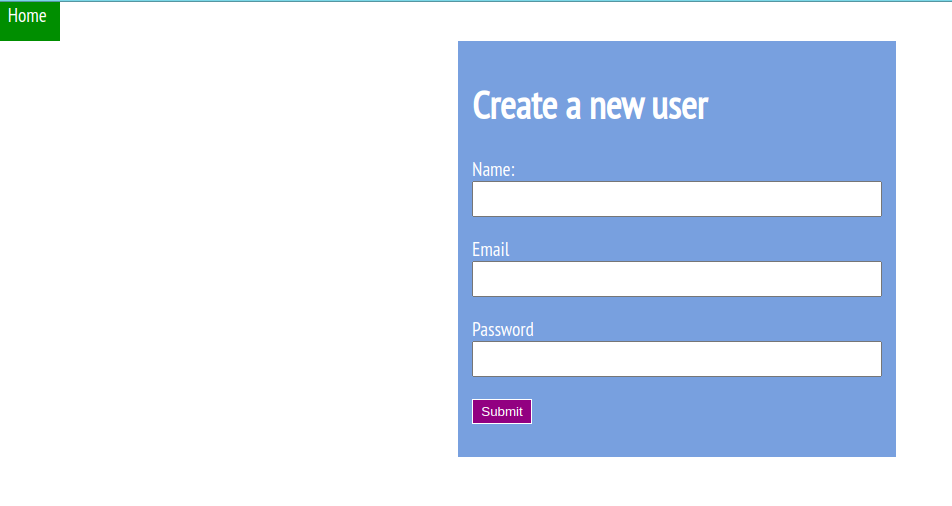
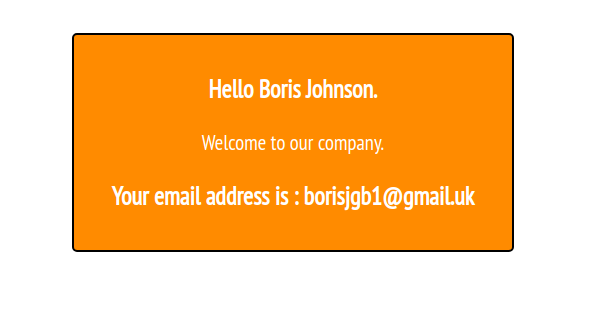

# Bare Metal Forms and Helpers

> This is a rail project where we built a form in traditional way. We have then replaced the form with rails form helpers. This project allow user to generate
new user and store their information in the database.





## Built With

- Ruby on Rails
- Ruby
- Rubocop
- Atom text editor

# Getting Started

To get a local copy of the repository please run the following commands on your terminal:

```
$ cd <folder>
```

```bash
$ git clone `https://github.com/ajkacca457/Bare-Metal-Forms-and-Helpers.git`
$ cd Bare-Metal_Forms_and_Helpers
$ bundle install --without production
$ yarn install --check-files
$ Run `rails db:migrate` to create necessary tables in database
```

# Authors

👤 **Avijit Karmaker**

- Github: [@Avijit](https://github.com/ajkacca457)
- Linkedin:[@Avijit](https://www.linkedin.com/in/avijit-karmaker-8738a54)

👤 **Damilola Oduronbi**

- Github:[@Damilola](https://github.com/oracleot)
- Linkedin:[@Damilola]( https://www.linkedin.com/in/doduronbi)

## 🤝 Contributing

Contributions, issues and feature requests are welcome!

## Show your support

Give a ⭐️ if you like this project!
